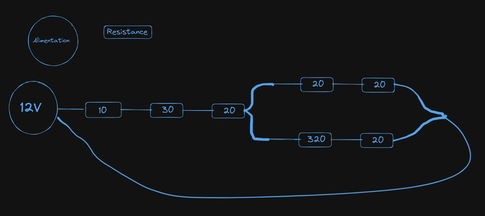

# Simulateur de Circuits Électriques en Rust

Ce simulateur de circuits est un outil en ligne de commande développé en Rust qui permet de simuler des circuits électriques définis par des fichiers JSON. Il supporte les configurations en série et en parallèle et prend en charge le calcul des tensions aux bornes de chaque résistance.

## Caractéristiques

- **Création de circuits via JSON** : Définissez vos circuits dans un format JSON facile à comprendre et à utiliser.
- **Simulation de configurations en série et parallèle** : Testez divers agencements de circuits, y compris des combinaisons complexes de composants en série et en parallèle.
- **Calcul automatique des tensions** : Obtenez les tensions aux bornes de chaque composant automatiquement.

## Dépendances

Ce projet utilise [Serde](https://serde.rs/) pour la sérialisation/désérialisation JSON. Assurez-vous d'avoir Rust et Cargo installés sur votre machine pour construire et exécuter l'application.

## Installation

Clonez ce dépôt en utilisant Git :

Construisez le projet avec Cargo :

```bash
cargo build --release
```

## Utilisation

Pour exécuter le simulateur de circuits, utilisez la commande suivante :

```bash
cargo run --release
```

## Exemple de fichier de circuit

Voici un exemple de fichier de circuit en JSON :

```json
{
  "power_supply": { "voltage": 12.0 },
  "intensity": 0.0,
  "circuit": [
    {
      "Component": {
        "Resistor": { "resistance": 10.0, "tension_in_circuit": 0.0 }
      }
    },
    {
      "Component": {
        "Resistor": { "resistance": 30.0, "tension_in_circuit": 0.0 }
      }
    },
    {
      "Component": {
        "Resistor": { "resistance": 20.0, "tension_in_circuit": 0.0 }
      }
    },
    {
      "Parallel": [
        [
          {
            "Component": {
              "Resistor": { "resistance": 20.0, "tension_in_circuit": 0.0 }
            }
          },
          {
            "Component": {
              "Resistor": { "resistance": 20.0, "tension_in_circuit": 0.0 }
            }
          }
        ],
        [
          {
            "Component": {
              "Resistor": { "resistance": 320.0, "tension_in_circuit": 0.0 }
            }
          },
          {
            "Component": {
              "Resistor": { "resistance": 20.0, "tension_in_circuit": 0.0 }
            }
          }
        ]
      ]
    }
  ]
}
```

## Image Du Circuit Électrique


